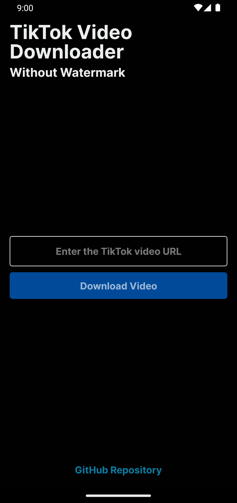
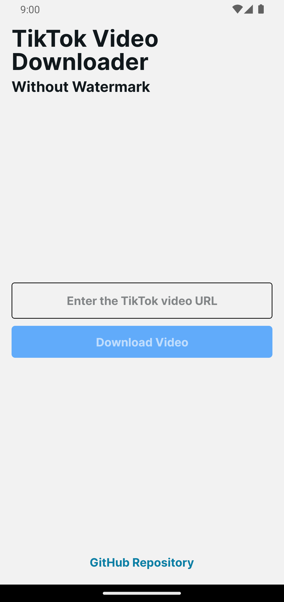

# TikTok Video Downloader

<table>
  <tr>
    <td align="center"></td>
    <td align="center"></td>
  </tr>
</table>

This React Native application allows you to download TikTok videos without a watermark quickly and easily.

## Features

- **Fast Download**: Download TikTok videos without a watermark in seconds.
- **Local Storage**: Save videos directly to your device.
- **No Ads**: Download videos without ads

## Requirements

- Node.js (v14 or higher)
- npm
- React Native CLI
- Android Studio (for Android development)

## Installation

1. **Clone this repository**

   ```bash
   git clone https://github.com/Pablo-Restrepo/TikTok-Video-Downloader-App
   cd tiktok-video-downloader-app
   ```

2. **Install dependencies**

   ```bash
   npm install
   ```

3. Expo CLI: Install Expo CLI globally

    ```bash
   npm install -g expo-cli
   ```

4. Run the application (with virtual device android)

    ```bash
    npm start
    ```
    Press 'a' to open in android

## License

This app is licensed under the GNU License. See the [LICENSE](LICENSE) file for more details.